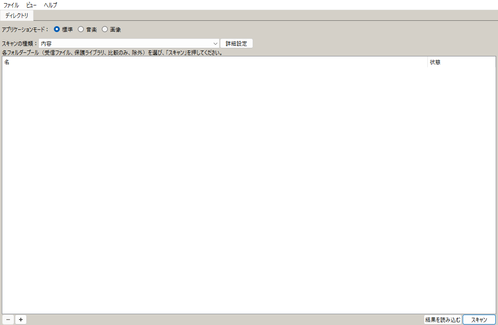
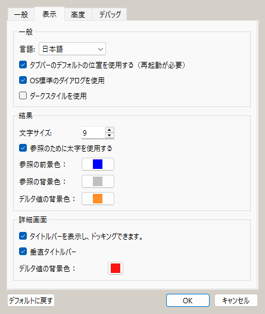
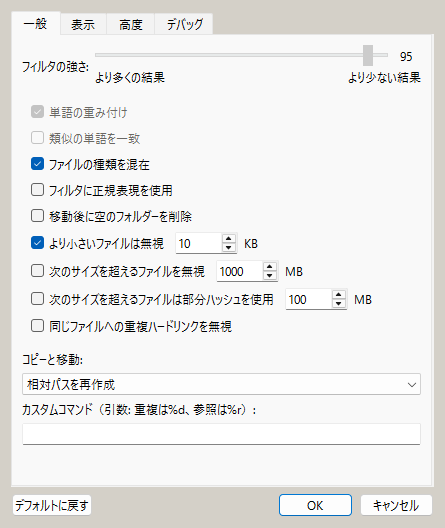
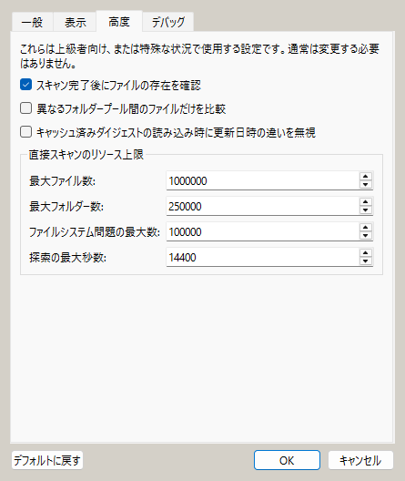

# dupeGuru Neo

[English README](README.en.md) | **日本語**

[**Windows 10 / 11版 5.3.0 をダウンロード（ZIP）**](https://github.com/AiWithYou/dupeguru_neo/releases/download/desktop-5.3.0-dev/dupeguru-neo-5.3.0-windows-x86_64-unsigned-portable.zip) |
[ほかのリリース](https://github.com/AiWithYou/dupeguru_neo/releases) |
[最新の Windows / macOS 開発ビルド](https://github.com/AiWithYou/dupeguru_neo/actions/workflows/default.yml?query=branch%3Amaster+event%3Apush)

dupeGuru Neo は、Windows、macOS、Linux に対応した、安全性を最優先する
重複検出・大規模メディアライブラリ整理ツールです。dupeGuru の成熟した
Python コアと Qt デスクトップ操作を受け継ぎながら、すべての判定結果と
ファイル操作について、その根拠を明示します。

中心となる原則は単純です。高速ハッシュや知覚ハッシュは候補の絞り込みには
使えますが、それだけで削除を許可することはありません。

## Neo で変わったこと

- **Verified Exact エンジン。** ファイルをサイズと任意のサンプルハッシュで
  分類し、候補の全内容をストリーミングハッシュしたうえで、最後にバイト単位で
  比較します。完全一致グループは全組み合わせを作らず、線形のメモリ量で表現
  します。
- **既定で復元可能なファイル操作。** デスクトップアプリと CLI は、リンクを
  追跡せずに削除候補と保存側の両方を開き直し、ファイル識別情報と SHA-256 の
  証拠を再検証してから、同一ボリューム上の隔離領域へ移動します。操作は耐久性の
  あるジャーナルに記録され、復元と完全削除は別々の明示操作です。
- **スキャン範囲を含む証拠。** 読み取り不能、スキャン中の変更、スキップ、
  キャンセル、資源上限への到達があると、結果は「不完全」と記録されます。
  不完全な証拠が暗黙に破壊的操作の権限を得ることはありません。
- **永続ライブラリカタログ。** ローカル SQLite カタログが、安定したファイル
  ID、パス、内容世代、完全一致の派生成果物、変更不能なスキャン履歴、再開可能な
  作業を保持します。画像特徴、サムネイル、動画フィンガープリント、ファイル操作
  の復旧ジャーナルは、検証規則とライフサイクルを分離した別ストアです。ネイティブ
  のファイル ID により移動履歴を維持できますが、信頼できるファイルシステムの
  イベントジャーナルが内容不変を証明しない限り、改名されたファイルは再解析します。
- **索引付き類似画像検索。** EXIF の向き、ICC カラー、アルファを正規化し、
  決定的な知覚ハッシュで候補を絞り込みます。最終的な視覚判定には既存の
  15×15 ブロック比較を使います。視覚的な類似とバイト単位の一致は、常に別の
  結果として表示します。
- **メディア・学習データ整理の基盤。** 説明可能な「残すファイル」の採点、
  画像と sidecar を一体で扱うデータセット計画、類似画像が train/validation/test
  をまたがない分割、FFmpeg／Chromaprint を使う動画フィンガープリントを備えます。
  利用可能な機能と部分結果は明示的に報告します。
- **自動化用インターフェース。** `dupeguru` は Qt に依存しない、バージョン付き
  JSON／JSONL CLI です。元ライブラリに作用する計画は `--execute` を明示しない
  限り検証だけを行います。読み取り専用解析でも、明示されたキャッシュ先や
  レポート先へは書き込む場合があります。

詳細な保証範囲と限界は
[docs/SAFETY_MODEL.md](docs/SAFETY_MODEL.md) に記載しています。

## 安全性ラベル

| ラベル | 意味 | 重複除去／隔離 | 整理目的のコピー／移動 |
| --- | --- | --- | --- |
| 緑／`verified_exact` | 安定した全ファイル証拠と最終バイト比較 | 実行直前の再検証に成功した場合だけ可能 | 保存先と比較プールのポリシー内で可能 |
| 黄／`similar` | デコードしたメディアが知覚的に類似 | 常に不可 | 完全かつ最新のスキャン後に限り明示操作可能。Copy／Move は Incoming Files のみ |
| 青／`related` | 類似しきい値未満の視覚的関連、または時間的に関連するメディア。埋め込み証拠がなければ意味的類似とは呼ばない | 常に不可 | 完全かつ最新のスキャン後に限り明示操作可能。Copy／Move は Incoming Files のみ |
| 灰／不完全 | 範囲、証拠、鮮度のいずれかが不足・失敗 | 拒否 | 拒否 |

整理目的の Move は元パスを変更しますが、「元ファイルが重複である」とは主張
しません。Copy と Move はどちらも、スキャンに結び付いた内容世代、現在の
Incoming Files ポリシー、既存ファイルを置換しない保存先公開を必要とします。
いずれも隔離、完全削除、通常の削除へ暗黙に変化しません。灰色の集約 Folder
結果からは実行できません。外部コマンドも別の明示的な信頼境界であり、
重複除去の保証は与えられません。

バイト一致が表すのは通常のファイル内容です。ACL、拡張属性、代替データ
ストリーム、リソースフォーク、バックアップ保持規則、法的保全は別の問題です。
削除を自動化する前に安全性モデルを確認してください。

## 必要環境

- CPython 3.10～3.14
- デスクトップアプリ用 PyQt6 6.11
- 画像解析用 Pillow 12
- ソースからインストールする場合は対応 C コンパイラ
  （画像比較モジュールはネイティブ拡張です）
- 動画解析用 FFmpeg／ffprobe、音声フィンガープリント用 `fpcalc`

リリースワークフローは、対応するすべての Python バージョンと OS でソースを
テストします。タグ付きリリースでは canonical な sdist を一度だけ作成し、
同じ sdist から CPython 3.13.14 用の Linux x86_64、Windows x86_64、
macOS arm64 のネイティブ wheel を作成して、バイト単位で再現できることを
検証します。公開 wheel の対象はこの 3 種類だけです。その他の Python
バージョンやアーキテクチャは sdist からインストールするため、コンパイラが
必要です。

パッケージ済み Windows デスクトップアプリは、64 ビット版 Windows 10 と
Windows 11 に対応します。

稼働中のカタログはローカルファイルシステムへ保存してください。NAS 上の
ライブラリは、そのファイルシステムが報告する機能の範囲でのみ対応します。
SQLite の WAL ファイルを共有上へ置くことはできません。Windows では、証拠を
生成するすべてのファイル観測について、元ボリュームに利用可能な USN 変更
ジャーナルが必要です。必要な USN 制御を使えないファイルシステムや共有は、
タイムスタンプへフォールバックせず、不完全として安全側に停止します。

Version 5 の完全ハッシュキャッシュは `hash_cache_v3.sqlite3` です。古い
`hash_cache.db` は、開く、インポートする、改名する、削除する、上書きする、
のいずれも行いません。手動で復旧または削除できるようアプリデータ領域に残し、
Version 5 の初回スキャンで新しい専用キャッシュへ完全ハッシュを再計算します。

## 画面で見る基本操作

起動直後の画面です。左下の「+」またはドラッグ＆ドロップで対象フォルダーを
追加し、フォルダープールとスキャンの種類を確認してから右下の「スキャン」を
押します。緑の完全一致だけが隔離操作の対象になり、類似画像などの結果は
確認専用です。



表示言語は `オプション` → `表示` → `言語` で変更できます。「日本語」を
選択して設定を保存し、アプリを再起動すると、アプリ固有の画面とQt標準部品、
アプリ内ヘルプが日本語になります。



一般設定では、照合の厳しさ、対象サイズ、部分ハッシュ、移動後の空フォルダー
処理などを設定できます。削除候補を扱う前に、設定内容と結果の根拠ラベルを
確認してください。



高度な設定では、異なるフォルダープール間だけを比較するモードや、直接探索の
ファイル数・フォルダー数・問題数・時間の上限を設定できます。大規模な完全一致
ライブラリには、再開可能な永続カタログを使う「内容」スキャンが適しています。



より詳しい手順は、アプリの `ヘルプ` → `dupeGuru Neo ヘルプ`、または
[日本語ヘルプのソース](help/ja/index.rst)を参照してください。

## すぐ使えるデスクトップ版

現在のソース版は **5.3.0** です。

- **Windows 10 / 11（64ビット）:**
  [**5.3.0 ポータブル ZIP を直接ダウンロード**](https://github.com/AiWithYou/dupeguru_neo/releases/download/desktop-5.3.0-dev/dupeguru-neo-5.3.0-windows-x86_64-unsigned-portable.zip)
  します。ダウンロード後に ZIP を右クリックして「すべて展開」を選び、展開した
  `dupeguru-neo` フォルダー内の `dupeguru-neo.exe` をダブルクリックしてください。
  Python やインストーラーは不要です。`_internal` フォルダーは実行に必要なので、
  EXE だけを別の場所へ移動しないでください。
- **チェックサム:**
  [SHA-256 ファイル](https://github.com/AiWithYou/dupeguru_neo/releases/download/desktop-5.3.0-dev/dupeguru-neo-5.3.0-windows-x86_64-unsigned-portable.zip.sha256)
- **macOS:** `dupeguru-neo-macos-app-<コミット>` をダウンロードし、GitHub の
  成果物を展開してから、中にある `.app.zip` を展開します。
  `dupeguru-neo.app` を Applications へ移動して開いてください。内側の ZIP は
  実行権限、フレームワークのシンボリックリンク、アプリバンドル構造を保持します。

Windows ZIP は恒久公開の
[5.3.0 開発用プレリリース](https://github.com/AiWithYou/dupeguru_neo/releases/tag/desktop-5.3.0-dev)
から、GitHub へのログインなしで取得できます。macOS 版や、さらに新しいコミットの
短期保存ビルドは、
[最新の成功した master push CI](https://github.com/AiWithYou/dupeguru_neo/actions/workflows/default.yml?query=branch%3Amaster+event%3Apush)
の Artifacts 欄から取得できます。Actions 成果物の取得には GitHub へのログインが
必要で、保存期間は 7 日間です。

これらは正式な署名済み安定版ではありません。Windows の実行ファイルは
Authenticode 未署名、macOS APP は ad-hoc 署名のみで Apple の公証を受けていない
ため、SmartScreen または Gatekeeper が警告を表示する場合があります。

## ソースからインストールして起動

Windows PowerShell:

```powershell
py -3.12 -m venv .venv
.\.venv\Scripts\Activate.ps1
python -m pip install --upgrade pip
python -m pip install -e ".[test,build]"
python build.py --modules
dupeguru-gui
```

macOS／Linux:

```sh
python3.12 -m venv .venv
. .venv/bin/activate
python -m pip install --upgrade pip
python -m pip install -e '.[test,build]'
python build.py --modules
dupeguru-gui
```

パッケージ済み画像リソースは通常の Python package data です。Qt 5、`pyrcc5`、
システム全体へインストールした PyQt は使いません。

## CLI クイックスタート

2 つのルートをスキャンし、バージョン付き JSONL レポートを保存します。

```sh
dupeguru scan Pictures Archive --format jsonl > scan.jsonl
```

直接完全一致スキャンには、探索と検証の上限があります。既定値は 1,000,000
ファイル、100,000 問題、250,000 検証済みグループ、4 時間です。
`--max-files`、`--max-issues`、`--max-groups`、`--max-seconds` で各上限を
明示できます。上限へ達すると、有効だが不完全なレポートを出力し、部分結果を
示す終了コードを返します。レビューはできますが、ファイル操作計画には変換
できません。

復元可能な隔離計画を作成します。

```sh
dupeguru plan scan.jsonl --operation quarantine > plan.jsonl
```

ファイルを変更せずに検証します。

```sh
dupeguru apply plan.jsonl --dry-run
```

レビュー済みの計画を実行します。

```sh
dupeguru apply plan.jsonl --execute
```

隔離済み操作の確認と復元:

```sh
dupeguru quarantine list Pictures Archive
dupeguru quarantine restore path/to/operation-plan.json --dry-run
dupeguru quarantine restore path/to/operation-plan.json --execute
```

完全削除は、完全一致計画にも `apply --execute` にも含まれません。隔離した
ファイルを確認したあと、保存済みの 1 操作だけを明示的に確定します。

```sh
dupeguru quarantine finalize path/to/operation-plan.json --dry-run
dupeguru quarantine finalize path/to/operation-plan.json --execute
```

永続ローカルカタログの作成・照会:

```sh
dupeguru catalog scan catalog.sqlite3 Pictures Archive
dupeguru catalog groups catalog.sqlite3 --page-size 500 > exact-groups.jsonl
dupeguru catalog changes catalog.sqlite3 --from 12 --to 13 > changes.jsonl
dupeguru catalog backup catalog.sqlite3 catalog-backup.sqlite3
```

`catalog changes` に渡す 2 つのスキャン ID は、同じルート集合を持つ、完全で
変更不能なスナップショットでなければなりません。カタログレポートは証拠であり、
ファイル操作を実行しません。変更レコードは version 2 の
`dupeguru.catalog-change-record` スキーマを使います。信頼できるイベント
ジャーナル証拠がない場合、2 つのパスで観測された 1 対 1 の安定ネイティブ ID は、
証明済み `moved` ではなく `relocation_candidate` として報告します。候補の分類は、
継続性の根拠が同じカタログ内容世代か、一致する canonical な完全 SHA-256
成果物かを明示します。どちらも破壊的操作の権限にはなりません。

カタログの完全一致グループは、再構築可能な
`dupeguru.catalog-group-record-v2` JSONL 契約を使います。最初に `header`、
各グループに `group_header`、1 個以上のバイト上限付き `member_chunk`、
`group_end`、最後に `summary` を出力します。カタログ出力は一時領域へ作成し、
完全に検証してから公開します。厳密 UTF-8 の物理行は改行を含め 8 MiB、
構造チャンクは 40,000 メンバー、総量 2 GiB、4,000,000 レコードが上限です。
グループ出力は最大 1,000,000 グループ、各グループ最大 1,000,000 メンバー、
変更出力は最大 3,999,998 変更です。集約投影は行を読み込む前に過大なグループを
拒否し、受理する SQL ページにも 1,000,000 行・1,000,000 メンバーの上限が
あります。公開前の上限、エンコード、一時記憶域、スキーマ、順序、件数の失敗では
標準出力を空のままにします。最後の標準出力コピーそのものが失敗した場合だけ、
検証済みの先頭部分が残る可能性があり、失敗終了になります。通常出力はバイナリ
ストリーム経由でコピーし、Windows のコードページや改行変換が検証済み
UTF-8／LF バイトを変更しないようにします。

`catalog groups` は読み取り専用のライブ投影です。バイト比較によって、保存済み
ダイジェストのバケットが現在のバイトを表していないと判明した場合、構造化された
「再スキャンが必要」エラーを返し、部分的なグループ出力は公開しません。同じ
データベースとルートで `dupeguru catalog scan` を再実行してください。書き込み
可能な scan コマンドは、その内容世代のすべての派生成果物と古い作業リースを
廃止し、新しい世代を作成して、設定済みの解析段階を再実行し、上限付きの検証を
1 回だけ再試行します。2 回目も不一致なら、ループせず安全側に失敗します。

読み取り専用動画ワークフローの確認、または画像データセット計画の準備:

```sh
dupeguru visual scan Pictures --cache ~/.cache/dupeguru/visual.sqlite3 --max-images 250000
dupeguru visual query reference.png Pictures --max-candidate-pairs 250000
dupeguru video capabilities
dupeguru video scan Videos --max-files 10000 --format jsonl > video-groups.jsonl
dupeguru dataset prepare-root Incoming --destination-root Organized
```

データセット復旧メタデータは、常に予約済み
`.dupeguru-neo-dataset-executor` ディレクトリ以下へ隔離し、後続スキャンから
除外します。`--state-root` を指定すると、それを状態ファイルそのものではなく
基底ディレクトリとして扱い、その予約済み子ディレクトリを使います。

Visual レポートに含まれる証拠は `similar` と `related` だけで、破壊的操作の
権限を与えません。ファイル数、候補数、一致数、デコード画素数、時間の上限は
CLI オプションで明示できます。上限へ達すると、有効な部分レポートと 0 以外の
部分結果終了コードを返します。永続 visual キャッシュは、スキャン対象ルートの
外に置かなければなりません。

すべての機械可読ドキュメントは、スキーマ名とバージョンを持ちます。
`dupeguru schema --help` と `dupeguru doctor` で、インストール済みの契約と
ローカル機能を確認できます。

完全一致レポートと計画の入力には上限があります。単一 JSON は最大 64 MiB、
JSONL は物理行ごとに最大 8 MiB、総量 2 GiB、1,100,000 物理行、
1,000,000 レコードです。スキャンレポートは最大 250,000 グループかつ
グループ内ファイル総数 1,000,000、削除計画は最大 250,000 操作です。そのため
完全一致スキャンと計画作成は、既定で JSONL を出力します。JSON／JSONL 出力は
最初の 1 バイトを書く前に同じ読み込み上限で全体を事前検証するため、上限超過で
標準出力に部分レポートを残しません。完全な文書が単一文書上限に収まる場合だけ
`--format json` を使ってください。動画ライブラリレポートも同じ JSON／JSONL
上限です。apply、query、doctor、quarantine、schema などのその他の単一 JSON
サービス出力も、最初の 1 バイトより前に同じ 64 MiB・構造上限で検証します。

データセットの prepare 入力と plan ファイルは厳密 JSON のみで、ファイルと
標準入力の双方が最大 128 MiB、最大 250,000 操作、250,000 ファイルレコード
です。JSON／CSV の plan export は 128 MiB の公開上限付きでストリーミング
します。これらは交換形式の上限です。クラッシュ復旧可能な 1 回の dataset apply
トランザクションは最大 10,000 ファイルレコードです。それを超える計画は分割が
必要です。完全な復旧ジャーナルを変更前に予約するため、非常に長いパスが多い場合は
実用上の件数上限が下がることがあります。上限は UTF-8 バイトで数え、超過入力・
出力は保存先を公開または置換せず、データセットを変更する前に失敗します。Raw
CSV は信頼できないパスと ID をそのまま保持するため、表計算ソフトで開かないで
ください。API 利用者は、損失の可能性を承知したうえで
`spreadsheet_safe=True` ビューを明示できます。大きな完全一致レポートには
JSONL を使ってください。すべての既定上限と公開 API 定数は
[自動化ガイド](help/en/automation.rst) を参照してください。

## 開発と検証

```sh
python -m pytest core hscommon qt/tests
python -m black --check .
python -m flake8 .
python build.py --modules
python run.py --self-test
```

リリース成果物は変更不能なタグから構築し、クリーン環境へインストールして、
依存関係の整合性、SHA-256 インベントリを検証します。GitHub attestation と、
タグ付きワークフローの identity および GitHub Actions OIDC issuer に結び付いた
ファイルごとの Sigstore bundle も生成します。集約 CycloneDX SBOM は Linux、
Windows、macOS の実行時依存スナップショットの和集合であるため、Windows 専用
`pywin32` も失われません。

リリースは `SHA256SUMS` で検証します。`requirements-release.txt` は正確な
バージョンを固定しますが、pip の `--require-hashes` ロックではありません。
インストール済み `RECORD` と独立したファイル manifest はインストール後の
provenance であり、パッケージインデックスから取得する wheel をインストール前に
認証するものではありません。

ローカル開発用 portable は 3 OS すべてでビルド・スモークテストします。
公式の `v*` タグ付きリリースワークフローでは、検証済み Windows EXE と
macOS APP を短期保存の CI 成果物としてのみアップロードし、署名付き公式
payload から除外します。利用しやすくするため、正確に同一で検証済みの 1 組を、
別名の `desktop-*` 開発用プレリリースへ複製する場合があります。この複製版も
未署名／ad-hoc のままで、正式な署名済み安定版にはなりません。Binary wheel
には、Python distribution より下位のネイティブ codec、描画ライブラリ、
runtime が組み込まれる場合があります。現在の source lock、license inventory、
SBOM は、その完全なネイティブコンポーネント閉包まではまだ証明していません。
公式リリースの厳密なトップレベル allowlist は契約外の資産を拒否し、独立した
上限付き archive scanner は、名前を変えたり別 archive に入れたりした
portable／source companion も拒否します。詳細は
[docs/RELEASE.md](docs/RELEASE.md) を参照してください。

## ソース構成

- `core/`: 証拠、スキャナー、カタログ、隔離、サービス、データセット、動画
- `qt/`: PyQt6 デスクトップ UI
- `images/`: UI 画像
- `help/`: Sphinx ユーザーマニュアル
- `scripts/`: CI、成果物スモークテスト、リリースメタデータ
- `pkg/`: ネイティブパッケージの雛形

## ライセンスと provenance

dupeGuru Neo は GPLv3 で配布されます。改造したバイナリを配布する場合は、
ライセンス条件に従い、対応ソースと GPL 表示を利用可能にする必要があります。
このプロジェクトは、元の dupeGuru contributors の履歴と attribution を保持
します。Neo 固有の保守は
[AiWithYou/dupeguru_neo](https://github.com/AiWithYou/dupeguru_neo)
で行っています。
